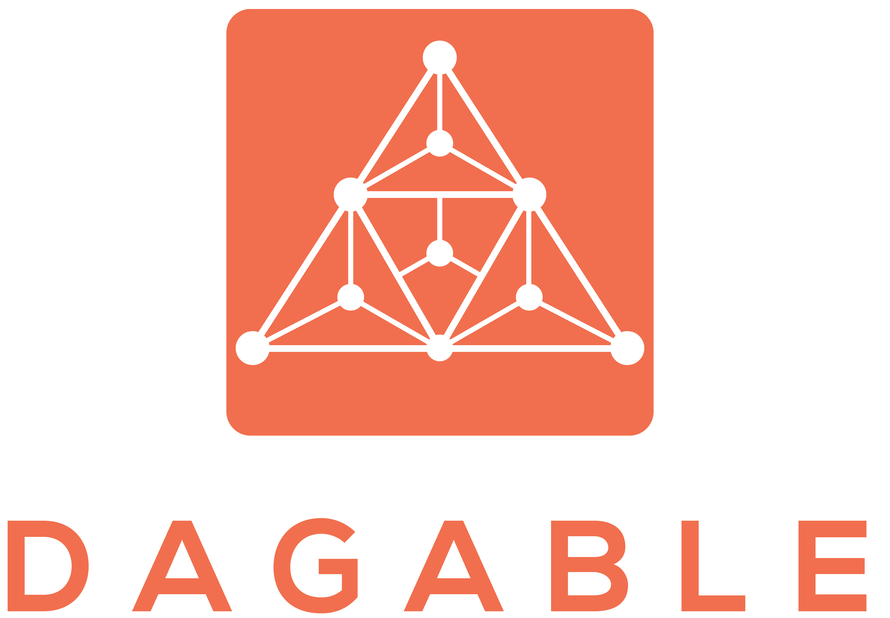

  

# Dagable API

The Dagable API provides a set of endpoints and functionalities to facilitate DAG retrieval, manipulation, and other functionality within the web application.

## Table of Contents

- [Features](#features)
- [Getting Started](#getting-started)
  - [Prerequisites](#prerequisites)
  - [Installation](#installation)
- [Usage](#usage)
- [API Documentation](#api-documentation)
- [Examples](#examples)
- [Contributing](#contributing)

## Features

- Creation of Standard and Critical Path DAGs.
- Save and later retrieve created DAGs to you own account
- More to come

## Getting Started

### Prerequisites

- .NET 7.0

### Installation

TODO

## Usage

TODO

## API Documentation

Navigate to `https://localhost:<port>/swagger/index.html` for Swagger documentation

## Examples

TODO
